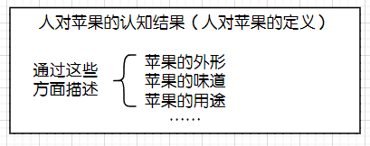
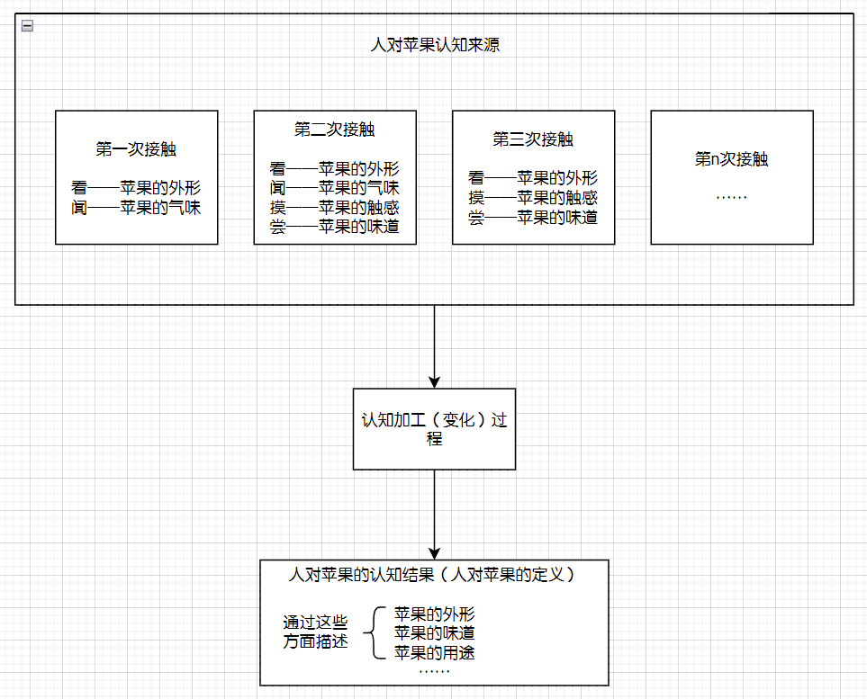
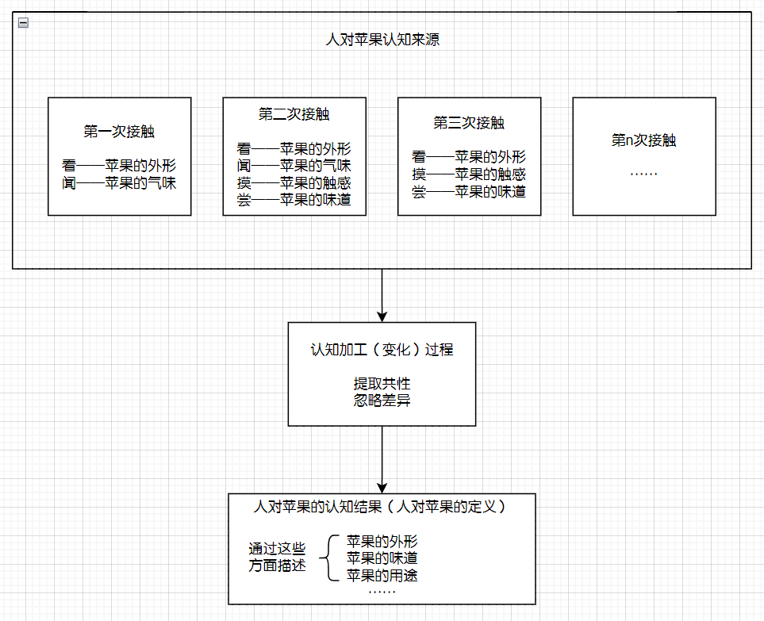
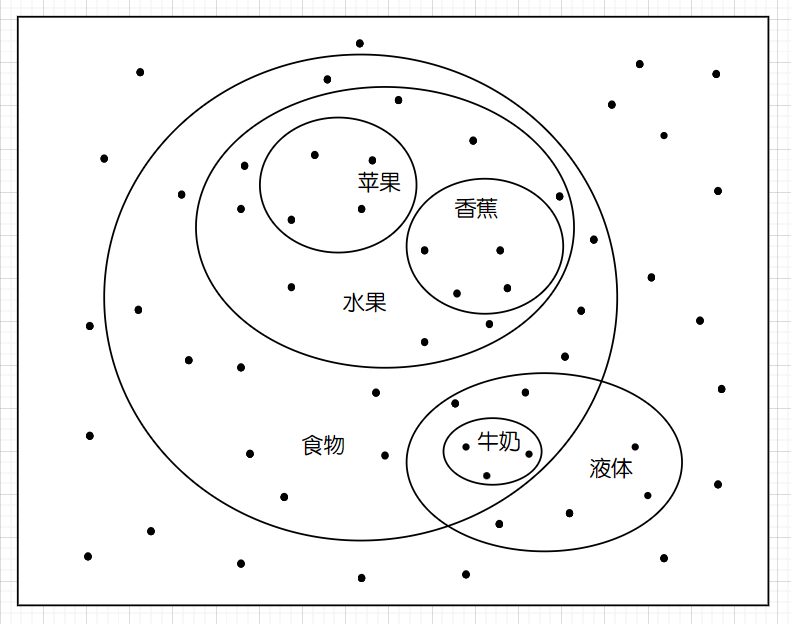

# 抽象论

## 简介

简单说就是笔者发现了抽象（提取共性）这么一把锤子，就满世界找钉子敲，然后发现，嘿，人思维过程中的很多东西的由来，还真的可以用抽象来解释。于是自信心爆棚想用抽象去搭建一套理论，从外界给人脑的输入开始，用抽象去构建出人思维里的所有东西，顺便得到一些方法论。文章大概就是这么来的，讲的大概就是这么个内容。

部分概念如红黄蓝绿等颜色，可以直接根据视觉上的相对相似性得到；

在过去，理论与实际的差异如果较小，就会被当作误差完全忽略，如果过大，就会认为理论存在错误。这是一种比较粗旷的处理方式，相当于二值化了差异。文章中将推导出一种方法，在承认理论的同时承认实际与理论差异的存在，并在此基础上，允许在理论与实际差异稍大时，仍能保证理论一定程度上的实用性。

## 快速上手

(施工中)

### 火腿肠模型

人每一瞬间的所有原始感受是不断变化的，如果按时间为横轴，用相同大小的圆形代表人每一瞬间的所有原始感受，我们将得到一个横向向一边延展的圆柱。人可以通过对比分辨出其中部分原始感受，其之间差异相较其余部分原始感受差异小，我们称分离出的这部分原始感受为原始感受团。人可以对比原始感受团之间的差异，我们把其中差异相对较小的原始感受团的集合称为一个原始感受团簇，把集合内所有原始感受团排除差异后的结果称为这个簇对应的原始概念。原始感受团、原始感受团之间的差异、原始概念都是感受团的一种。人可以对比感受团之间的差异，我们把其中差异相对较小的感受团的集合称为一个感受团簇，把集合内所有感受排除差异后的结果称为这个簇对应的概念。感受团之间的差异、概念也是感受团的一种。如果概念对应的感受团簇中含有感受团之间的差异，我们也称这个概念为规律。我们将上述排除感受团差异的过程称作抽象，也称作提取共性。

我们慢慢解释这段话。原始感受指的是人与外界接触时，不经后续加工的第一印象——更准确地说，假设有任意生理上完全相同但经历不同的人，处在某个完全相同的外界环境中，此时这些人思维中相同的部分就是人对这个环境的原始感受。因此原始感受会随着环境的不断变化而变化。我们基本可以认为绝大多数人生理上的差异并不大，若忽略这部分的差异，原始感受与外界环境一一对应，某种角度看等价于外界给大脑的所有信息。我们把人每一瞬间脑子里的所有所思所想称作感受，那么原始感受是感受的一部分。我们可以近似地认为，人在接触具体的东西时的直接感受都属于原始感受，比如你拿个苹果咬一口，你感受到的外观、触感、味道都属于原始感受。

抽象论认为，人认知有两个基本的思维过程。一是比较，想象你面前有两个苹果，只要你看得见，就可以轻松识别它们外观上的差异，在听觉嗅觉触觉上也是如此。这个比较不要求人在过去拥有任何经验或是知识，一个发育健全的新生儿也能做出这样的比较。不止是苹果，你也可以比较不同时间自己的情绪的差异，甚至两个对象的差异和另外两个对象的差异，我们会在后面给出一个直观的例子。我们把两个对象排除差异以外的部分称作二者的共性。二是聚焦，当你在看这段文字的时候，你会忽略周围其余部分的感受，像路过的鸟叫声，身上衣物的触感 ，气流通过鼻腔的感受等等。同样的，在声音、触觉方面，也都有类似的聚焦过程，比如你在地铁里偷听路人说话时，手机屏幕里的内容就会被忽略。我们之前说过，某种角度看原始感受等价于外界给大脑的所有信息，而大脑的处理能力我们认为是有限的，聚焦可以看作忽略的不相干的感受，只处理被聚焦部分的感受。同样，我们认为聚焦也是只依赖生理结构不依赖经验经历的，也就是人天生就会。我们把聚焦的内容，也就是人的所有感受排除被忽略的部分后剩下的部分，称作视野。在这个模型中，聚焦暂时不会用到。

假设有个理想化的“刚出生”的人，他没有任何生活经历但具有与常人无异的生理结构。当他第一次遇到一个苹果时，我们之前说过，他与苹果直接接触时的所有直接感受都属于原始感受。在进行下一步之前，有个很重要的问题，他需要先能将苹果视为一个独立的对象，而不是把苹果和下面的桌子视为一个整体，或者把苹果当作上下“半个苹果”两个单独的对象。抽象论认为，他是对比了当时所有的原始感受，区分出其中一部分，这部分之间的差异与这部分和其余部分的差异更小。我们把这部分称为原始感受团。苹果的外观、气味、触感等都是原始感受团。现在让这个人离开当前所在房间到隔壁房间休息，一段时间后再将他请回来，继续接触这个苹果。这次接触会产生新的原始感受团，并且外观、气味、触感等原始感受团与第一次的几乎没有差别，相对于这个人的其他原始感受团差异显著的小，因此他分别有了这个苹果的外观原始感受团簇、这个苹果的气味原始感受团簇等等，并有了对应的这个苹果外观的原始概念、这个苹果气味的原始概念等等。在这个人接下来的漫漫生命长河中，他又接触了几次不同的苹果，分别会生成苹果甲外观的原始概念、苹果乙气味的原始概念等等，这些比如苹果甲乙丙外观的原始概念，相对于其他感受内部差异又显著的小（对比苹果与苹果的差异与苹果与梨子甚至石头的差别，结论相当显著），因此他得到苹果的气味的概念、苹果的外观的概念、苹果的触感的概念等等，而这些概念在时空分布上具有显著小的内部差异（即总是同时同地出现），成为一个感受团簇，并得到对应的苹果的概念。为方便表述，接下来我们也把相对其余内部差异小称为相对相似性高。值得说明的是，上述过程中那位理想的人离开当前所在房间到隔壁房间休息的步骤是不必要的，他完全可以在和第一个苹果的持续接触中生成原始概念，上面这么写只是为了方便理解。

假设上述原始感受圆柱的左端是人出生时的起点，圆柱随人的运动向右延伸。对任意一瞬间右端是有限的（有限指存在更大的，如果你关心定义的话）。我们称此时的圆柱内的所有原始感受为此刻的已知。我们之前说过，人可以对比感受团之间的差异，我们把其中差异相对较小的感受团的集合称为一个感受团簇，把集合内所有感受排除差异后的结果称为这个簇对应的概念。在这个模型中我们认为在这句话中的“相对”是放在整个已知范围内比较的，也就是说，在所有已知感受中，所有苹果之间的差异比苹果与其他概念之间的差异要小，换句话说，苹果之间的共性要比苹果与其他概念之间的共性高，再具体点说，如果我们在苹果概念的感受团簇中加入别的感受，会让这个簇的内部差异显著增加，也就是共性显著下降。想象一堆苹果里混进一些香蕉，那你就不能称它们为一堆苹果了，可能会降级成一堆水果。另一方面，所有已知范围内的符合苹果共性的概念都是苹果。也就是说，只要在已知范围内， 某些感受团组成的集合具有某些共性，并且这个集合包含了所有具有这些共性的感受团，那么这个集合就构成一个感受团簇，而这些共性则构成一个概念。苹果是一个概念，苹果甲也是一个概念（在理想人论述中，苹果甲气味的概念、苹果甲外观的概念、苹果甲触感的概念等等也可以由时空共性构成簇，形成苹果甲概念），绿苹果是一个概念，香蕉是一个概念，水果也是一个概念，食物也是一个概念，请读者自行列举这些概念对应的感受团簇和共性（如果你在列举后面两个，尤其是最后一个的时候遇到了困难，那是正常的，不用难过）。

现在我们来理一下目前出现的概念之间的关系。首先脑子里的状态就叫感受，其中来自于外界的部分我们叫原始感受（更明确的定义请往回翻，这里的侧重点是概念间的关系），然后原始感受中相对相似的部分我们叫原始感受团，所有原始感受团里边相对相似的部分构成一个个原始感受团簇。原始感受与原始感受之间的差异可以认为是原始感受的一部分。那么原始感受团簇里的原始感受团排除差异后剩下的结果也就是共性也就是原始概念，自然也可以认为是原始感受团的一部分。在继续讨论感受团之前，我们先回头来看一下之前理想的人的苹果的例子，在得到某个苹果甲气味的原始概念、苹果甲外观的原始概念、苹果甲触感的原始概念后，根据这些概念在时空分布上的相似性，构成感受团簇。接下来我们将指出，原始感受团是可以有时间轴的，也就是说，人们可以直接将一小段带着变化历程的苹果甲的原始感受作为原始感受团。这只需要在“人能在每一瞬间的原始感受中划分出原始感受团”的基础上，额外说明“人能对时间划分出不同阶段”就可以了。而答案是显然的，并且划分依据依旧是相对相似性高。于是，每一次与苹果接触的经历分别成为原始感受团，其

于是，舌头与苹果果肉的触感和苹果肉酸甜的味道感受序列

事实上，正向构建理解起来很困难，我们可以倒过来论证。所有某对象的性质都可以定义为这个对象与另一些特定对象（我们称外部条件）交互后会共同产生特定结果。如果两个对象与相同的具有特定性质的外部条件交互后总会产生相同的具有特定性质的结果，我们就认为两个对象的某性质相同。也就是说，性质的比较是通过外部条件与结果的分别比较实现的。而两个对象的比较又可以通过比较所有性质来实现，即如果两个对象的所有性质相同，那么我们可以认为这其实是同一个对象。那如果我们对某条性质，比较其外部条件与结果，将外部条件与结果视作对象，依次比较每条性质，再比较每条性质的外部条件与结果……持续下去，最终我们会比较到人直感感受

感受会随已知的增长不断修正。

### 加盐火腿肠模型

接下来我们要在我们的火腿肠上引入浓度的概念。我们之前的模型很不错，但是有一点点问题，其中比较直观的是，这个人不会遗忘，总是忠实地记录了所有的经历（已知只增不减），并且总是在已知的全局范围生成感受团。我们知道，一般人都是会忘记的，并且没有能力同时处理“自出生以来的所有感受”那么大量的信息。我们想到可以用之前提到过的聚焦能力解决这个问题，但仍需解释聚焦的内容的来源，也就是视野范围是如何选取的（简单说就是逃不掉至少一次全局比较，不过比较的实现方式可以探讨）。另一个问题是，我们知道有心理阴影这么一种现象，简单说就是过去的一次经历留下了负面印象，以后遇到相似场景的时候会过度恐惧。我们有之前的模型可以很好解释为什么会恐惧，但解释不了为什么一次。

----

(下面这部分已废弃)

我们取任意两个对象，让这两个对象分别与相同的外界条件交互，观察交互的效果。更换不同的外界条件重复这个实验，如果在某个外界条件下，这两个对象表现出相同的效果，我们称这两个对象具有某种相同的性质，且该性质与上述外界条件对应。在无数的外界条件中，我们取所有使交互效果相同的外界条件，将它们对应的性质的集合称作这两个对象的模型。同时，我们称这两个对象在这些外界条件下相同。进一步，对三个及以上的对象，我们也可以重复上述操作，得到它们的模型。

如果我们根据对象A与B的模型$M_{AB}$的某些性质做出了一些推论，我们可以将做出上述推论的过程对着A或B做一遍，由于A与B具有与模型完全相同的性质，因此我们也会得到相同的结论。模型是源对象共同性质的集合，无论是模型的性质还是基于模型性质的推论，都可以直接应用到模型的源对象上。

~~如果有A与B相似，B与C相似，我们不能得到A与C相似，这是人们在生活中非常常见的误用。但是如果A与B的模型为$M_{AB}$，模型$M_{AB}$作为对象与C相似，且它们的模型为D，那么基于D的性质与推论可以在ABC上应用。形象地说，相似不能横向传递，只能纵向传递。~~ TODO：大修

在没有任何其他信息的情况下，已知某事件$e$发生后产生结果$r_a$的可能性为$p$（不一定是概率），那么我们认为

## 慢速上手

(暂停施工，需要重新设计)

我们从一个简单的例子入手。有一天，一位科学家坐在果树下乘凉。突然，树上一颗熟透的苹果——暂停一下，来思考几个问题：我们是如何认识苹果的？或者说当我们阅读到“苹果”这俩字时，脑海里想到了什么？更多的，我们用“苹果”一词代指的含义，是如何在人与人之间传播的？

第二个问题相对直观，我们先来试着简单回答一下。当看见苹果这一词时，我们的脑海中可能会出现红黄相间的颜色、表皮蜡状的触感、沙沙脆脆的口感、酸甜的味道……或者是苹果的简笔画、苹果俩字的发音、某次啃苹果的经历……或者其他与苹果有关联的东西。我们总结一下这些东西有哪些共同特点。一是都与苹果有关，或者是苹果的某些特性，或是与苹果一起发生过什么，或是更间接的关联——比如某个喜欢吃苹果的人。二是你能想到的这些都是你之前经历过的：如果你能想象苹果的样子，那你以前一定见过对应的实物；如果你能想象苹果的触感，那你以前一定摸过或者把玩过苹果。相反的，如果你之前没有与之接触的经历，那你就无法想象对应的感受。比如有一种水果叫瑰丽凤胆，我只跟你说这个名字，你能想到什么？你只能从这名字的四个字里去散发联想，而不能像苹果那般脑海里立刻出现它的样子或者触感。我们对第二个问题简单做个总结：

> 当看到“苹果”这一词时，我们会想到直接或间接与苹果有关联的东西，并且这些都来自我们之前的经历。

接下来思考第一个问题。在这之前，我们先来想一想什么是苹果。我们可能会说，苹果是一种水果，一般具有怎样的外形、怎样的味道、可以用来做什么等等。

这是ChatGPT给出的关于“苹果的是什么”的回答，但只仅仅作为一个参考。对于一个具体的人，在回答“苹果是什么”时，可能不能给出这么全面的回答，他只能根据自己的认知来描述这些方面。举个例子，如果一个人生来就只”接触“过红黄色的苹果（包括各种渠道，如上网或听别人说等），那他在描述时就不会额外提及别的颜色；类似的，如果他从没听说过苹果饼、苹果派等，也不会介绍这些用途。我们对“苹果的是什么”的回答，其实就是我们对苹果的定义，可以认为是我们对苹果的认知结果。总结如下：

我们清楚了人们对苹果认知的结果，然后再考虑人们对苹果认知的来源。我们想象一个现在知道苹果是什么的人，在他刚出生的时候，肯定是不知道苹果是什么的[^无知预设]。然后在他成长、生活过程中，不止一次的接触到了苹果，每次或是摸了或是看了或是尝了。每次接触根据交互类型他都会有相应的感受。我们可以认为，这些感受，就是他对苹果认知的最初来源。同样总结如下：

现在我们只需弄明白中间的“认知变化过程”，即可完成对第一个问题“我们是如何认识苹果的”的回答。我们想要搞清楚这中间发生了什么——我们与实在的苹果接触的感受是如何转变为脑海里的认知的，一个简单的办法就是比较前后的差别——对苹果的认知结果与对苹果实物感受的差别。让我们闭上眼回想一下，我们想象出来的苹果的样子，和你曾经接触过的真正的某一个苹果的样子完全一样吗？我们知道，世界上没有两片相同的叶子，苹果也是如此，这就意味着你曾经接触过的每个苹果实物，互相之间都长的不一样。如果我们想象出来的和之前接触过的某个一模一样，那这个是哪一个呢？为什么偏偏是那一个？他有何独特之处？另外如果你要能想象得一模一样，那你至少要记住那个苹果的所有细节，这几乎是不可能的。因此可以知道，我们认知中的苹果，与之前接触过的所有苹果的实物，都不完全一样。那具体有什么差别呢？依旧以外形举例，理想中苹果的形状，是身子圆圆的，然后可能下端稍小，上端稍大，头顶和脚底向内凹陷，头顶的凹陷里还有个把，颜色则是红黄相间的。而我们曾接触过的苹果实物，一方面，全都能符合前面的描述，都是圆圆的、下窄上宽、红黄相间；另一方面，又没有一个真的长的标准的圆，宽窄也各有特色，具体颜色和分布也各有差异，没有一个苹果真的长得跟你想象的一模一样。再具体一点来说，我们认知中的苹果，和曾接触过的苹果相比，少了很多细节：我们记住了他们大体上是圆圆的，但不会在意哪个苹果在哪个部位相比标准圆突出了多少，哪个苹果在哪个部位相比标准圆凹陷了多少。另一方面，我们对苹果的认知，又提取了所有我们曾经接触过的苹果的共性：所有接触过的苹果都符合我们对理想苹果的描述。并且，我们对理想苹果的认知都来自于曾经接触过的所有苹果，不会凭空多出来什么——如果一个人从没见过（包括任何渠道）紫色或者绿色的苹果，那他认知中的苹果就不会有这两个颜色——就像我们不会觉得天然未加工的苹果会有天蓝色一样。可以这么说，我们的认知过程就是对直接接触时的感受做了筛减，提取了每次接触共同的部分，忽略了细节上的差异。我们总结一下我们的结论：

我们差不多能够回答第一个问题了，但这里还有一些小问题。之前说了，我们曾经接触过的每一个苹果的实物，长得其实都不一样，甚至如果你通过考察每一个细小的地方去比较其中两个苹果，会发现几乎很难找到完全一样的部分——以外观举例，苹果表面色块大小形状、颜色的色差、形状凹凸，很难完全一致。那也就是说，你接触过的所有苹果，其实都是完全不同的东西。随之而来的问题就是，为什么你偏偏会把它们放在一起比较，提取共性呢？要知道，你这一辈子接触过的东西多了去了，所有的东西都是像苹果那样，仔细比较起来互相之间都是完全不相同的。既然它们都是互不相同的东西，为什么你偏偏会把其中几个放在一起提取共性呢？一个简单的解释就是，我们其实会对所有接触过的东西做比较，提取共性，并把具有相同特性的东西放在一起，将它们所有的共同特性作为对它们的认知结果。我们来验证一下这个想法的正确性。比如几个香蕉和几个苹果放在一块，我们知道它们都有香甜的气味、去皮能吃、放久会腐烂等等；比如水、牛奶、油，我们知道它们都不具有稳定的形状等等。并且类似苹果，我们也有提取共性后形成的认知结果——前者（香蕉苹果）叫做水果，后者（水牛奶油）叫做液体。基本上，随便找几个身边的实物出来，我们都知晓他们的共性，并拥有对应的认知结果。于是我们得到一个理想化的认知模型：我们会对接触过的所有的实物之间比较，当发现其中一部分实物有一些共同特性，我们就把这些共同特性的集合当作对所有具有这些特性的实物的认知结果。为了表述方便，接下来我们把认知的结果，也就是这些共同特性的集合叫做**概念**。

在上图中，每个点代表我们曾接触过的一个实物，每个圈代表这些实物具有一些共同特性，这些共同特性对应的概念则是圈里的文字。我们可以看到概念之间有重叠或者包含关系，这意味着这些实物的共同特性的集合之间，具有相交或包含关系。如牛奶除了有牛奶之间的共同性质外，既有所有食物的共同性质，又有所有液体的共同性质；苹果除了有苹果之间的共同性质外，既有所有水果的共同性质，又有所有食物的共同性质。说个题外话，如果我们把概念对应的性质的集合之间的重叠或包含关系也用类似上图的形式画出来，会发现结果与上图刚好相反——苹果和香蕉重叠，都包含水果，包含食物；而牛奶又包含食物和液体。

让我们回头来整理一下思绪。我们之前建立了针对苹果的认知模型：我们提取对苹果感受的共性形成对苹果的概念。而刚刚的模型把认知对象扩展到了所有的实物——我们提取若干实物的共性形成对具有这些特性的实物的概念。我们马上注意到了一个问题，之前对苹果的认知结果基本可以从接触苹果时的直接感受得到，而面对香蕉苹果、水牛奶油这些组合时我们总结的共性有些并不是直接感受得到的，比如去皮能吃、放久会腐烂，比如不具有稳定的形状，这些性质，并不是我们通过视觉和触觉感受到的——想象一个第一次接触香蕉的人拿着一个把玩，他不可能光靠看摸闻就知道这个东西放久了会腐烂。那我们来看看这些性质具体描述了什么。去皮能吃，实际上说的是苹果香蕉等去除外皮后，人吃了不会有负面反应；放久会腐烂，指的是苹果香蕉放着不管一段时间后总会变成另一种状态，同时包括外形气味触感和可食用性等的变化；不具有稳定的形状，指的是水牛奶油不依靠外部环境支撑无法保持住自己的形状。我们总结一下这三条性质的共同特点，都是某对象（苹果、水）和特定外部环境交互后（去皮后喂给人类、放着不管、无外壁支撑）会有什么结果（人类活蹦乱跳、腐烂、变成一滩）。也就是说，除了给我们的直接感受上的相似外，如果若干实物在与特定外部条件交互后总是会产生相同的特定的结果，也能作为共性被我们认知，也就是成为概念的一部分。注意，这里不是说某实物在某些特定条件下，这个实物本身发生了变化——考虑可食用这个性质，食物吃了给人吃了后人没事，这很难用单食物自己的变化来概括。这里的结果指的是将实物与外部条件视为一个整体，变化后的结果。更一般地，我们可以提炼出性质这一概念：对任意一个实物$a$，如果和同一个外部条件$E$交互总产生相同的结果$r$，我们称实物$a$都具有性质$P_{E \rightarrow r}$[^字母与符号]（这里性质的标记$P_{E \rightarrow r}$中含有$E$和$r$仅仅是为了强调这条性质对外部条件$E$和结果$r$的依赖关系，箭头表示一个变化过程）。如果两个实物$a$和$b$都具有相同的性质$P_{E \rightarrow r}$，那么它们在外部条件$E$下时是可以互相代替的，也就是等价的，因为总是会产生相同的结果$r$。看到这里可能有的人会有疑惑，这是正常的，因为我们没有明确相同外部条件和相同结果具体要怎么判断，这一点后头还要再细谈。我们先回头来看之前的三条性质，想象一个场景，一个人因为饿了或是什么原因，现在就想找点东西吃，那么现在苹果、香蕉、橙子等所有具有去皮能吃属性的实物对他来说都是等效的，可以互相代替的，因为至少在吃了没事这一点上，结果可以认为是相同的；对于苹果、蔬菜、牛奶等，人们会采取相同的措施（尽快食用）以避免它们腐烂；无论是水、牛奶，我们在存放时都会使用容器以防止滩在地上。观察上面这三个场景，你一定有不少疑问，其中最要命的是，我们之前在性质概念的定义中讲了，具有同一性质意味着最后会产生相同的结果，并且这个结果指的是实物和环境共同变化后的结果，就按人吃水果举例，一个人吃了苹果或香蕉，从人没生病这一点上来看两者都是一样的，但是如果不加条件的比较两种情况，我们可以找到非常多的差异，比如味道不同，营养成分不同，吃了之后消化吸收甚至心情肯定都不一样。那要如何解释结果相同？或者说给出一个明确的对二者结果的比较方式。同样环境也需要一个明确的相同的定义。我们回想之前性质的定义，其实就是在试图解答实物之间的性质差异是如何比较的。也就是说，这个定义其实把实物性质如何比较的问题转化成了环境和结果如何比较的问题。递归地解决比较问题

如此一来，我们把比较的内容从直接感受上的差异扩展到了包括性质上的异同。

感受可以定义成一种特殊的性质。

苹果的概念与水果的概念有什么区别？你说水果下面有不同的实物，苹果概念下也有不同的实物，你说水果下面包含了更小的概念，苹果下面其实也包含了更小的概念。再看软件，再看概念的概念。虚无缥缈吗？并不，都有对应的实物。况且实物也没想象的那么实在。是否可以把抽象的对象的范围从实物拓展到概念。

我们思考一个问题，假如现在我给你一个实物，一看，是个新鲜苹果，那你觉得它可以食用吗？答案大概率是肯定的，但是为什么呢？你肯定会下意识地说，因为它是新鲜苹果呀，新鲜苹果就是可以食用的。

整理一下我们目前得到的理想化的认知过程：一个人接触了很多实物，每次接触都会有不同的感受。人会对这些实物基于感受两两比较，提取共性

TODO：

把对实物的比较转化成了对环境和结果的比较

”都具有稳定的形状（区别于水）“ 提取共性是否需要和其他东西（周围环境）做对比才能出来？要的。对直观感受来说，比较只能知道两个对象之间的差异，相同其实是没有差异，而“没有”你是看不出来的，相同间接地来自于两个对象与其他对象都有某个方面的差异，而这两个对象之间没有这方面的差异。对性质来说，性质异同取决于与环境交互后结果异同，而结果异同间接或直接的来自于直观感受异同，因此同样的需要与环境相对的对比。

视野：缩减我们观察的范围

怎么知道苹果是苹果；理解对 苹果图案，简笔画 等的认知

介绍特点/好处

1. 节省记忆空间
2. 预测

改进形式化，加入依概率预测

提供快速入手

（不用在意那位可能会被苹果砸到的科学家，他不是今天的重点）

[^无知预设]:如果你不觉得这是事实，你也可以把它当作建立抽象论所必须的假设，类似公理看待。需要注意的是，这个假设并不要求人刚出生时什么都不知道，它只关注**不会到会的部分**——只要你有后天新学的东西，对那部分东西而言，刚出生的人是无知的。

[^字母与符号]:文章中出现的字母与符号仅仅是为了标记和指代方便，相当于取了个别名。本文所有的符号或标记在首次出现时都会做充分的说明，并且不会做任何计算，请放心阅读。
