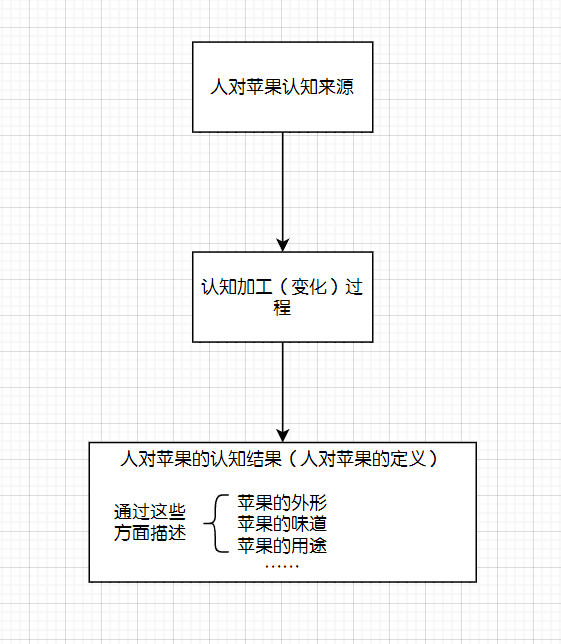

# 抽象论

本文分享了我对人认知的思考，尤其是对人思维过程中，提取共性这一行为的研究。

## 快速上手

我们从一个简单的例子入手。有一天，一位科学家坐在果树下乘凉。突然，树上一颗熟透的苹果——暂停一下，来思考几个问题：我们是如何认识苹果的？或者说当我们阅读到“苹果”这俩字时，脑海里想到了什么？更多的，我们用“苹果”一词代指的含义，是如何在人与人之间传播的？

第二个问题相对直观，我们先来试着简单回答一下。当看见苹果这一词时，我们的脑海中可能会出现红黄相间的颜色、表皮蜡状的触感、沙沙脆脆的口感、酸甜的味道……或者是苹果的简笔画、苹果俩字的发音、某次啃苹果的经历……或者其他与苹果有关联的东西。我们总结一下这些东西有哪些共同特点。一是都与苹果有关，或者是苹果的某些特性，或是与苹果一起发生过什么，或是更间接的关联——比如某个喜欢吃苹果的人。二是你能想到的这些都是你之前经历过的：如果你能想象苹果的样子，那你以前一定见过对应的实物；如果你能想象苹果的触感，那你以前一定摸过或者把玩过苹果。相反的，如果你之前没有与之接触的经历，那你就无法想象对应的感觉。比如有一种水果叫瑰丽凤胆，我只跟你说这个名字，你能想到什么？你只能从这名字的四个字里去散发联想，而不能像苹果那般脑海里立刻出现它的样子或者触感。我们对第二个问题简单做个总结：

> 当看到“苹果”这一词时，我们会想到直接或间接与苹果有关联的东西，并且这些都来自我们之前的经历。

接下来思考第一个问题。在这之前，我们先来想一想什么是苹果。我们可能会说，苹果是一种水果，一般具有怎样的外形、怎样的味道、可以用来做什么等等。

这是ChatGPT给出的关于“苹果的是什么”的回答，但只仅仅作为一个参考。对于一个具体的人，在回答“苹果是什么”时，可能不能给出这么全面的回答，他只能根据自己的认知来描述这些方面。举个例子，如果一个人生来就只”接触“过红黄色的苹果（包括各种渠道，如上网或听别人说等），那他在描述时就不会额外提及别的颜色；类似的，如果他从没听说过苹果饼、苹果派等，也不会介绍这些用途。总结如下：

这边我们按时间维度考虑这个问题。一个人对苹果的认知的结果，也就是他对“苹果是什么”的问题的回答。接下来我们再来思考“人们对苹果的认知是从哪里来的”。我们先只考虑人与苹果直接接触的场景——就是一个人一生只接触过实物苹果，没有接触过衍生品如苹果的简笔画、苹果照片、苹果3D动画等。想象一个现在知道苹果是什么的人，在他刚出生的时候，肯定是不知道苹果是什么的[^无知预设]。然后在他成长、生活过程中，不止一次的接触到了苹果，每次或是摸了或是看了或是尝了。每次接触根据交互类型他都会有相应的感受。我们可以认为，这些感受，就是他对苹果认知的最初来源。

[^无知预设]:如果你不觉得这是事实，你也可以把它当作建立抽象论所必须的假设，类似公理。需要注意的是，这个假设并不要求人刚出生时什么都不知道，它只关注**不会到会的部分**——只要你有后天新学的东西，对那部分东西而言，刚出生的人是无知的。

TODO：

画每次接触的框图，引出抽象假设

TODO：

介绍特点/好处

1. 节省记忆空间
2. 预测

（不用在意那位可能会被苹果砸到的科学家，他不是今天的重点）

## 形式化

我们取任意两个对象，让这两个对象分别与相同的外界条件交互，观察交互的效果。如果在某个外界条件下，这两个对象表现出相同的效果，我们称这两个对象具有某种相同的性质，且该性质与上述外界条件一一对应。在无数的外界条件中，我们取所有使交互效果相同的外界条件，将它们对应的性质的集合称作这两个对象的模型。同时，我们称这两个对象在这些外界条件下相似。进一步，对三个及以上的对象，我们也可以重复上述操作，得到它们的模型。

如果我们根据对象A与B的模型$M_{AB}$的某些性质做出了一些推论，我们可以将做出上述推论的过程对着A或B做一遍，由于A与B具有与模型完全相同的性质，因此我们也会得到相同的结论。模型是源对象共同性质的集合，无论是模型的性质还是基于模型性质的推论，都可以直接应用到模型的源对象上。

如果有A与B相似，B与C相似，我们不能得到A与C相似，这是人们在生活中非常常见的误用。但是如果A与B的模型为$M_{AB}$，模型$M_{AB}$作为对象与C相似，且它们的模型为D，那么基于D的性质与推论可以在ABC上应用。形象地说，相似不能横向传递，只能纵向传递。

## 有什么用